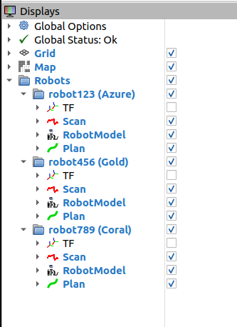
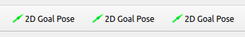
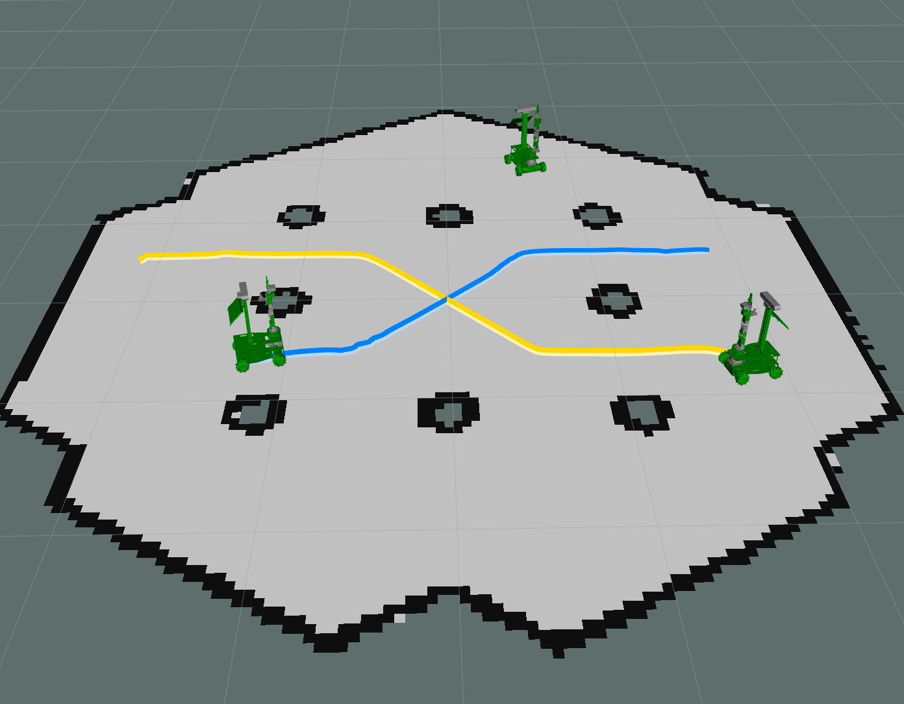
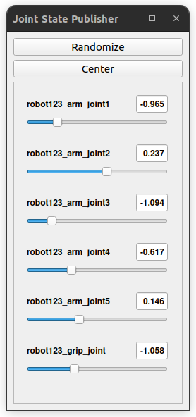

# Simulation & Scenarios Guide

This guide explains how to run the multi robot simulation, launch research scenarios, and manually control robots inside a simulated environment.

> **Note:** If you haven't yet built the workspace, see [Getting Started](getting_started.md).

---

## Table of Contents

- [1. Introduction](#1-introduction)
- [2. Simulation Overview](#2-simulation-overview)
- [3. Running the Simulation](#3-running-the-simulation)
  - [A) Single Robot Simulation](#a-single-robot-simulation)
  - [B) Add Additional Robots](#b-add-additional-robots)
  - [C) Multi Robot Launch](#c-multi-robot-launch)
- [4. Navigation in Simulation](#4-navigation-in-simulation)
  - [A) Using 2D Goal Pose in RViz](#a-using-2d-goal-pose-in-rviz)
  - [B) Using NavigateToPose Action](#b-using-navigatetopose-action)
- [5. Scenario 1: Consensus in Anonymous Multi Robot Systems](#5-scenario-1-consensus-in-anonymous-multi-robot-systems)
- [6. Scenario 2: Rescue Coordination (Patrol & Rescue)](#6-scenario-2-rescue-coordination-patrol--rescue)
  - [A) Patrolling Robots](#a-patrolling-robots)
  - [B) Rescue Robot](#b-rescue-robot)
- [7. Scenario 3: Pick and Place (Placeholder)](#7-scenario-3-pick-and-place-placeholder)

---

## 1. Introduction

This document explains how to simulate:

- Single robot navigation  
- Multi robot environments  
- Scenario based coordination  
- Direct control via `/cmd_vel`  
- Action based Nav2 control  

Simulation lets you test everything without requiring physical robots.

---

## 2. Simulation Overview

Each simulated robot runs:

- Navigation2 stack  
- TF tree and robot description  
- Map server  
- Namespaced topics (`/robot123/...`)  
- NavigateToPose action server  

Rviz display tree example:


*Figure 1: Example RViz display tree for three robots (`robot123`, `robot456` and `robot789`).*

---

## 3. Running the Simulation

### A) Single Robot Simulation

```bash
ros2 launch x3plus_multi_bringup one_robot.launch.py \
  robot_id:=123 \
  map:=/absolute/path/to/map.yaml \
  rviz:=true
```

### B) Add Additional Robots

```bash
ros2 launch x3plus_multi_bringup one_robot.launch.py \
  robot_id:=456 \
  map:=/absolute/path/to/map.yaml \
  rviz:=false
```

### C) Multi Robot Launch

```bash
ros2 launch x3plus_multi_bringup multi_robot.launch.py \
  robots_id:=123,456,789 \
  prefix:=robot \
  map:=/absolute/path/to/map.yaml
```

---

## 4. Navigation in Simulation

### A) Using 2D Goal Pose in RViz

RViz provides one “2D Goal Pose” tool per robot namespace, and their order in the toolbar matches the order of robots shown in the RViz Display Tree.
\

*Figure 2: 2D Goal Pose tool for each robot, one per robot namespace.*

*Figure 3: RViz view showing multiple robots navigating to independent goal poses.*

### B) Using NavigateToPose Action

```bash
ros2 action send_goal /$ROBOT/navigate_to_pose nav2_msgs/action/NavigateToPose \
"{pose: {header: {frame_id: map}, pose: {position: {x:$X, y:$Y}, orientation:{w:$W}}}}"
```
Where:
- `$ROBOT` is the robot namespace (e.g. `robot123`) 
- `$X` is the target x-coordinate in the map frame 
- `$Y` is the target y-coordinate in the map frame 
- `$W` is the quaternion w component of the orientation
    - For no rotation (facing forward), use w = 1.0
### C) Using `/cmd_vel`
Each simulated robot subscribes to its own velocity command topic:

- `/robot123/cmd_vel`
- `/robot456/cmd_vel`
- `/robot789/cmd_vel`

Whenever a `geometry_msgs/Twist` message is published on one of these topics, the corresponding robot updates its motion in the simulation.
The commands below publish `geometry_msgs/Twist` messages for a fixed duration using `timeout`.
The numeric values shown are **examples** and can be adjusted as needed.

#### Velocity conventions

```bash
timeout 5 ros2 topic pub -r 20 /$ROBOT/cmd_vel geometry_msgs/Twist \
"{linear: {x: $X}, angular: {z: $Z}}"
```

- `$X (linear.x)`
  - Positive values → move forward
  - Negative values → move backward

- `$Z (angular.z)`
  - Positive values → rotate left (counter-clockwise)
  - Negative values → rotate right (clockwise)

All values are expressed in meters per second (linear) and radians per second (angular).

---

## 5. Scenario 1: Consensus in Anonymous Multi Robot Systems

In this scenario, robots are controlled directly using `/cmd_vel`.
Each robot listens to its own namespaced velocity topic (e.g. `/robot123/cmd_vel`)
and updates its motion accordingly in the simulation.

The commands below are **example motion primitives** that can be combined or repeated
to study consensus behavior.

### Example motion commands

- **Move forward**
  ```bash
  timeout 5 ros2 topic pub -r 20 /$ROBOT/cmd_vel geometry_msgs/Twist \
  "{linear: {x: 0.1}, angular: {z: 0.0}}" > /dev/null 2>&1
  ```

- **Turn right**
    ```bash
    timeout 5 ros2 topic pub -r 20 /$ROBOT/cmd_vel geometry_msgs/Twist \
    "{linear: {x: 0.1}, angular: {z: -0.2}}" > /dev/null 2>&1
    ```

- **Turn left**
    ```bash
    timeout 5 ros2 topic pub -r 20 /$ROBOT/cmd_vel geometry_msgs/Twist \
    "{linear: {x: 0.1}, angular: {z: 0.2}}" > /dev/null 2>&1
    ```
    
- **Move backward**
    ```bash
    timeout 5 ros2 topic pub -r 20 /$ROBOT/cmd_vel geometry_msgs/Twist \
    "{linear: {x: -0.1}, angular: {z: 0.0}}" > /dev/null 2>&1
    ```

- **Stop**
    ```bash
    timeout 5 ros2 topic pub -r 20 /$ROBOT/cmd_vel geometry_msgs/Twist \
    "{linear: {x: 0.0}, angular: {z: 0.0}}" > /dev/null 2>&1
    ```


---

## 6. Scenario 2: Rescue Coordination (Patrol & Rescue)

### A) Patrolling Robots

#### Terminal 1:

```bash
ros2 run scenarios patrol_rescue --ros-args -p robot_ns:=$ROBOT
```
#### Terminal 2 (optional, used for manual coordination commands):
**Command descriptions:**

* **Set rescue target coordinates**

  ```bash
  ros2 param set /$ROBOT/patrol_rescue rescue_xy "[$X, $Y]"
  ```

  * Defines the rescue location in the map frame
  * Must be set before triggering a rescue
  * Coordinates typically come from another robot or monitoring node

* **Pause patrol**

  ```bash
  ros2 service call /$ROBOT/patrol_enable std_srvs/srv/SetBool "{data:false}"
  ```

  * Temporarily stops the patrolling behavior
  * Allows the robot to switch from patrol to rescue mode

* **Trigger rescue**

  ```bash
  ros2 service call /$ROBOT/patrol_rescue std_srvs/srv/Trigger "{}"
  ```

  * Commands the robot to navigate to the rescue coordinates
  * Uses Nav2 to reach the specified location

* **Resume patrol**

  ```bash
  ros2 service call /$ROBOT/patrol_enable std_srvs/srv/SetBool "{data:true}"
  ```

  * Restarts patrolling, used after the rescue is completed.

**Where:**

* `$ROBOT` is the robot namespace (e.g. `robot123`)
* `$X` is the target x-coordinate in the map frame
* `$Y` is the target y-coordinate in the map frame

---

### B) Rescue Robot

The robot that requires assistance runs a lightweight node that retrieves its current position
from the navigation stack and makes it available for coordination.

```bash
ros2 run scenarios get_coords --ros-args -p robot:=$ROBOT
```
The command outputs the robot’s current 2D position in the map frame expressed as:

```text
[x, y]
```

Where `x` and `y` correspond to the robot’s current coordinates in the map frame.
This coordinate pair matches the format expected by the `rescue_xy` parameter and is used directly by patrolling robots when triggering a rescue.

This information can then be propagated to patrolling robots through the communication infrastructure to define the rescue target location.

---

## 7. Scenario 3: Pick and Place (Work in Progress)

This scenario focuses on **manipulation and coordinated task execution** using the robot’s arm.
It is currently under development and will be expanded incrementally.

At this stage, the simulation provides **manual joint-level control** to test kinematics,
arm reachability, and integration with the navigation stack.

### Manual joint control GUI

For each simulated robot there is a dedicated GUI that allows manual manipulation of its arm joints.  
Each GUI instance is tied to a single robot namespace, meaning you can independently control
the arm of `robot123`, `robot456`, etc.

This tool is primarily used for:
- Verifying joint limits and ranges
- Testing arm reachability in simulation
- Debugging arm configuration and TF alignment


*Figure 4: Joint control GUI for manual arm manipulation in the `robot123` namespace.*

### Planned motion planning integration

Future versions of this scenario will integrate **motion planning** to enable
automatic and collision-aware arm movement.

The planned additions include:
- Integration with a motion planning framework (e.g. MoveIt)
- End-effector pose targets instead of joint-level commands
- Automatic trajectory generation for pick and place tasks
- Safer and more intuitive manipulation logic

This will significantly simplify manipulation by allowing users to specify **goal poses**
instead of manually computing joint angles.

### Intended pick and place tasks

Once completed, the scenario will support tasks such as:
- Navigating to an object location
- Picking up an object using the robotic arm
- Transporting the object to a target location
- Placing or handing over the object
- Coordinating multiple robots for shared manipulation tasks

The scenario is designed to run both in simulation and on real hardware,
reusing the same task logic and interfaces.


---

